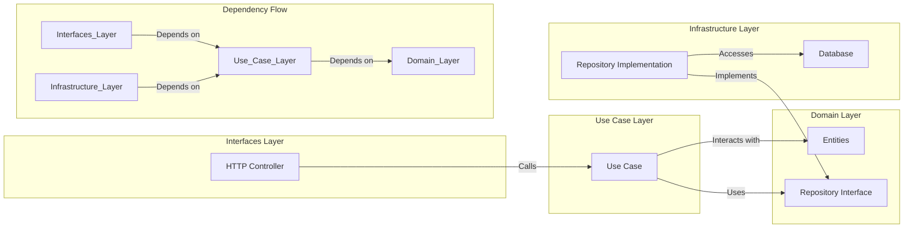

# Boot Backend Go Clean

[**中文**](./README.zh-CN.md)

### Introduction

`Boot Backend Go Clean` is a production-ready backend template engineered with **Go** and the principles of **Clean Architecture**. It is designed to solve the common problem of unstructured, hard-to-maintain codebases by providing a clear separation of concerns. This template empowers developers to build scalable, testable, and adaptable applications where business logic is decoupled from external frameworks and infrastructure details.

### The Philosophy of Clean Architecture

The primary goal of Clean Architecture is to create systems that are:
1.  **Independent of Frameworks**: The architecture does not depend on the existence of some library of feature-laden software. This allows you to use such frameworks as tools, rather than having to cram your system into their limited constraints.
2.  **Testable**: The business rules can be tested without the UI, Database, Web Server, or any other external element.
3.  **Independent of UI**: The UI can change easily, without changing the rest of the system.
4.  **Independent of Database**: You can swap out PostgreSQL for MySQL, MongoDB, or something else entirely. Your business rules are not bound to the database.

The mechanism that achieves this is the **Dependency Rule**, which states that *source code dependencies can only point inwards*. Inner layers define interfaces (abstractions), and outer layers provide the concrete implementations. This is an application of the Dependency Inversion Principle.

-   **Domain Layer**: This is the heart of the application. It contains the most general, high-level business rules and entities. This layer is the most stable and should have no dependencies on any other layer in the project.
-   **Use Case Layer**: This layer contains application-specific business logic. It orchestrates the flow of data to and from the domain entities to achieve the goals of a particular use case. It depends on the Domain Layer but has no knowledge of the layers outside it.
-   **Interfaces Layer**: This layer acts as a set of adapters that convert data from a format convenient for external agents (like web browsers or test scripts) to a format convenient for the Use Case and Domain layers. It includes controllers and presenters.
-   **Infrastructure Layer**: This outermost layer is where all the details go. It provides concrete implementations for the interfaces defined by the inner layers. This includes databases, the web framework, and any other external libraries.

### Project Structure

```
.
├── cmd                   # Application entry point
├── internal
│   ├── app                 # Application setup (server)
│   ├── domain              # Domain Layer: Core business logic, entities, and interfaces
│   ├── infrastructure      # Infrastructure Layer: Concrete implementations (e.g., database)
│   ├── interfaces          # Interfaces Layer: Controllers, middleware, routes
│   └── usecase             # Use Case Layer: Implementation of business logic
└── ...
```

### Architecture Flow



### Getting Started

#### Prerequisites

- Go 1.25.0+
- PostgreSQL
- Docker & Docker Compose (Recommended)

#### Installation

1.  **Clone the repository**:
    ```bash
    git clone https://github.com/kirklin/boot-backend-go-clean.git
    cd boot-backend-go-clean
    ```
2.  **Set up environment variables**:
    ```bash
    cp .env.example .env
    ```
    *Modify `.env` with your local configuration.*
3.  **Install dependencies**:
    ```bash
    go mod tidy
    ```
4.  **Run the application**:
    ```bash
    go run cmd/main.go
    ```

### Deployment with Docker (Recommended)

1.  **Prepare configuration**: Ensure your `.env` file is configured. For Docker, `DATABASE_HOST` should be the service name (`postgres`).
2.  **Build and run**:
    ```bash
    docker-compose up -d --build
    ```
3.  **Verify status**:
    ```bash
    docker-compose ps
    ```
4.  **Stop services**:
    ```bash
    docker-compose down
    ```

### Testing

To run all tests:
```bash
go test ./...
```

### License

This project is licensed under the Apache License. See the [LICENSE](LICENSE) file for details.
