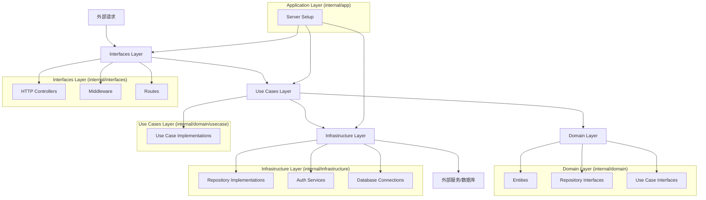

# Boot Backend Go Clean

这是一个基于Go语言和Clean Architecture的后端项目模板。它提供了一个结构化的方法来构建可扩展、可维护的Web应用程序。

## 项目结构

```
.
├── cmd
│   └── main.go                 # 应用程序入口点
├── internal
│   ├── domain                  # 领域层：核心业务逻辑和规则
│   │   ├── entity              # 业务实体
│   │   ├── repository          # 仓库接口
│   │   └── usecase             # 用例接口
│   ├── infrastructure          # 基础设施层：外部接口的实现
│   │   ├── auth                # 认证相关实现
│   │   └── persistence         # 数据持久化实现
│   ├── interfaces              # 接口层：处理外部请求
│   │   ├── http
│   │       ├── controller      # HTTP控制器
│   │       ├── middleware      # HTTP中间件
│   │       └── route           # 路由定义
│   ├── usecase                 # 用例层：业务逻辑实现
│   └── app
│       └── server              # 应用程序服务器设置
├── pkg                         # 可重用的包
│   ├── configs                 # 配置相关
│   ├── database                # 数据库连接和管理
│   └── logger                  # 日志工具
├── migrations                  # 数据库迁移文件
└── scripts                     # 各种脚本工具
```

## Clean Architecture流程



### Clean Architecture的代码编写逻辑和执行流程：

1. Domain Layer (`internal/domain`):
   - 首先定义 Entities（实体）
   - 然后定义 Repository Interfaces（仓库接口）
   - 最后定义 Use Case Interfaces（用例接口）

2. Use Cases Layer (`internal/usecase`):
   - 实现 Use Case Interfaces，编写具体的业务逻辑

3. Infrastructure Layer (`internal/infrastructure`):
   - 实现 Repository Interfaces，处理数据持久化
   - 实现认证服务、数据库连接等底层功能

4. Interfaces Layer (`internal/interfaces`):
   - 实现 HTTP Controllers，处理请求和响应
   - 实现 Middleware，如认证、日志等
   - 定义 Routes，设置 API 路由

5. Application Layer (`internal/app`):
   - 设置和配置服务器，组装各个组件

#### 执行流程：

1. 程序从 `cmd/main.go` 启动，初始化 Application Layer。
2. Application Layer 设置服务器，组装各个组件。
3. 外部请求通过 Interfaces Layer 的路由进入系统。
4. 请求经过相应的 Middleware 处理。
5. Controller 接收请求，调用相应的 Use Case。
6. Use Case 实现业务逻辑，使用 Domain Layer 的实体和接口。
7. 如需持久化或外部服务，Use Case 通过 Repository Interface 调用 Infrastructure Layer。
8. Infrastructure Layer 与数据库或外部服务交互，返回结果。
9. 结果沿着调用链返回，最终由 Controller 格式化响应并返回给客户端。

#### 编写顺序建议：

1. Domain Layer: 实体 -> 仓库接口 -> 用例接口
2. Use Cases Layer: 用例实现
3. Infrastructure Layer: 仓库实现、认证服务等
4. Interfaces Layer: 控制器 -> 中间件 -> 路由
5. Application Layer: 服务器设置和组件组装

## 开始使用

### 前置条件

- Go 1.23+
- PostgreSQL

### 安装

1. 克隆仓库：

```bash
git clone https://github.com/kirklin/boot-backend-go-clean.git
cd boot-backend-go-clean
```

2. 安装依赖：

```bash
go mod tidy
```

3. 设置环境变量：

复制 `.env.example` 到 `.env` 并根据你的环境进行修改。

4. 运行应用：

```bash
go run cmd/main.go
```

## 开发指南

### 添加新功能

1. 在 `internal/domain/entity` 中定义新的实体。
2. 在 `internal/domain/repository` 中定义新的仓库接口。
3. 在 `internal/domain/usecase` 中定义新的用例接口。
4. 在 `internal/usecase` 中实现用例。
5. 在 `internal/infrastructure/persistence` 中实现仓库。
6. 在 `internal/interfaces/http/controller` 中添加新的控制器。
7. 在 `internal/interfaces/http/route` 中添加新的路由。

## 测试

运行所有测试：

```bash
go test ./...
```

## 部署

1. 构建应用：

```bash
go build -o app cmd/main.go
```

2. 运行应用：

```bash
./app
```

## 许可证

本项目采用 Apache 许可证。详情请见 [LICENSE](LICENSE) 文件。