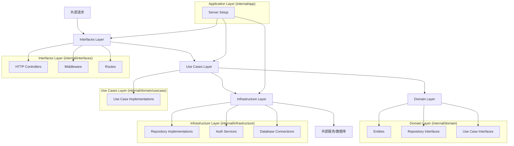

## 目录结构：

```
.
├── cmd
│   └── main.go
├── internal
│   ├── domain
│   │   ├── entity
│   │   ├── repository
│   │   └── usecase
│   ├── infrastructure
│   │   ├── auth
│   │   └── persistence
│   ├── interfaces
│   │   ├── http
│   │   │   ├── controller
│   │   │   ├── middleware
│   │   │   └── route
│   │   └── repository
│   ├── usecase
│   └── app
│       └── server
├── pkg
│   ├── configs
│   ├── database
│   └── logger
├── migrations
└── scripts
```

### clean architecture流程图：



### Clean Architecture的代码编写逻辑和执行流程：

1. Domain Layer (`internal/domain`):
   - 首先定义 Entities（实体）
   - 然后定义 Repository Interfaces（仓库接口）
   - 最后定义 Use Case Interfaces（用例接口）

2. Use Cases Layer (`internal/domain/usecase`):
   - 实现 Use Case Interfaces，编写具体的业务逻辑

3. Infrastructure Layer (`internal/infrastructure`):
   - 实现 Repository Interfaces，处理数据持久化
   - 实现认证服务、数据库连接等底层功能

4. Interfaces Layer (`internal/interfaces`):
   - 实现 HTTP Controllers，处理请求和响应
   - 实现 Middleware，如认证、日志等
   - 定义 Routes，设置 API 路由

5. Application Layer (`internal/app`):
   - 设置和配置服务器，组装各个组件

执行流程：

1. 程序从 `cmd/main.go` 启动，初始化 Application Layer。
2. Application Layer 设置服务器，组装各个组件。
3. 外部请求通过 Interfaces Layer 的路由进入系统。
4. 请求经过相应的 Middleware 处理。
5. Controller 接收请求，调用相应的 Use Case。
6. Use Case 实现业务逻辑，使用 Domain Layer 的实体和接口。
7. 如需持久化或外部服务，Use Case 通过 Repository Interface 调用 Infrastructure Layer。
8. Infrastructure Layer 与数据库或外部服务交互，返回结果。
9. 结果沿着调用链返回，最终由 Controller 格式化响应并返回给客户端。

编写顺序建议：

1. Domain Layer: 实体 -> 仓库接口 -> 用例接口
2. Use Cases Layer: 用例实现
3. Infrastructure Layer: 仓库实现、认证服务等
4. Interfaces Layer: 控制器 -> 中间件 -> 路由
5. Application Layer: 服务器设置和组件组装
