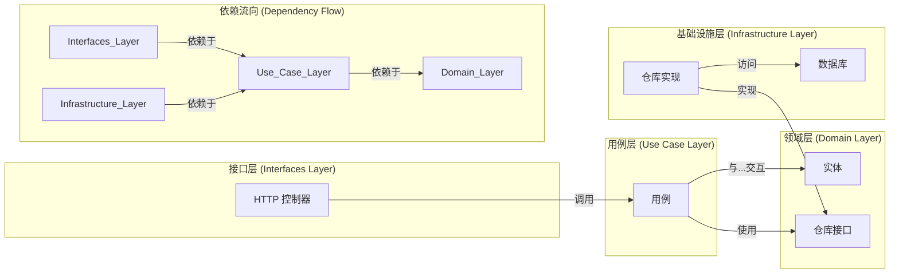

# Boot Backend Go Clean

[**English**](./README.md)

### 介绍

`Boot Backend Go Clean` 是一个采用 **Go** 语言和 **整洁架构 (Clean Architecture)** 原则构建的、生产就绪的后端模板。它旨在通过明确的**关注点分离**来解决代码库结构混乱、难以维护的普遍问题。该模板使开发人员能够构建可扩展、可测试和高适应性的应用程序，其中核心业务逻辑与外部框架和基础设施细节完全解耦。

### 整洁架构的设计哲学

整洁架构的首要目标是创建满足以下条件的系统：
1.  **独立于框架**：架构不依赖于任何功能丰富的软件库。这使您可以将框架作为工具使用，而不是被迫将系统塞进其有限的约束中。
2.  **可测试**：业务规则可以在没有 UI、数据库、Web 服务器或任何其他外部元素的情况下进行测试。
3.  **独立于 UI**：UI 可以轻松更改，而无需更改系统的其余部分。
4.  **独立于数据库**：您可以将 PostgreSQL 换成 MySQL、MongoDB 或其他完全不同的数据库。您的业务规则不与数据库绑定。

实现这一目标的核心机制是**依赖关系原则 (The Dependency Rule)**，即*源代码的依赖关系只能指向内部*。内层定义接口（抽象），外层提供具体实现。这是**依赖倒置原则**的实际应用。

-   **领域层 (Domain Layer)**：应用程序的核心。它包含最通用、最高级别的业务规则和实体。该层最稳定，不应依赖于项目中的任何其他层。
-   **用例层 (Use Case Layer)**：包含特定于应用程序的业务逻辑。它编排数据流向领域实体，以实现特定用例的目标。它依赖于领域层，但对其外部的层一无所知。
-   **接口层 (Interfaces Layer)**：该层充当适配器集，将数据从便于外部代理（如 Web 浏览器或测试脚本）的格式转换为便于用例层和领域层的格式。它包括控制器和展示器。
-   **基础设施层 (Infrastructure Layer)**：这是最外层，所有实现细节都在这里。它为内层定义的接口提供具体实现，包括数据库、Web 框架和任何其他外部库。

### 项目结构

```
.
├── cmd                   # 应用程序入口
├── internal
│   ├── app                 # 应用程序设置 (server)
│   ├── domain              # 领域层: 核心业务逻辑、实体和接口
│   ├── infrastructure      # 基础设施层: 具体实现 (例如数据库)
│   ├── interfaces          # 接口层: 控制器、中间件、路由
│   └── usecase             # 用例层: 业务逻辑的实现
└── ...
```

### 架构流程



### 开始使用

#### 前置条件

- Go 1.25.0+
- PostgreSQL
- Docker 和 Docker Compose (推荐)

#### 安装

1.  **克隆仓库**:
    ```bash
    git clone https://github.com/kirklin/boot-backend-go-clean.git
    cd boot-backend-go-clean
    ```
2.  **设置环境变量**:
    ```bash
    cp .env.example .env
    ```
    *在 `.env` 文件中修改为您的本地配置。*
3.  **安装依赖**:
    ```bash
    go mod tidy
    ```
4.  **运行应用**:
    ```bash
    go run cmd/main.go
    ```

### 使用 Docker 部署 (推荐)

1.  **准备配置**: 确保您的 `.env` 文件已配置。对于 Docker, `DATABASE_HOST` 应为服务名 (`postgres`)。
2.  **构建并运行**:
    ```bash
    docker-compose up -d --build
    ```
3.  **验证状态**:
    ```bash
    docker-compose ps
    ```
4.  **停止服务**:
    ```bash
    docker-compose down
    ```

### 测试

运行所有测试：
```bash
go test ./...
```

### 许可证

本项目采用 Apache 许可证。详情请见 [LICENSE](LICENSE) 文件。
